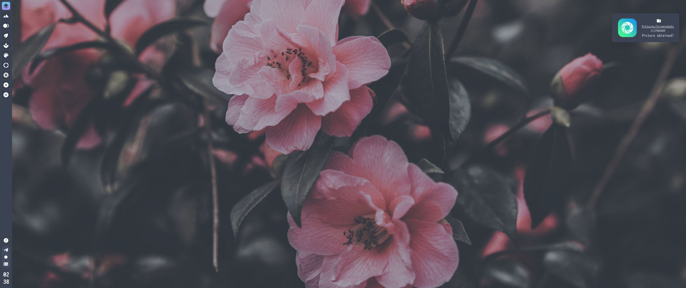
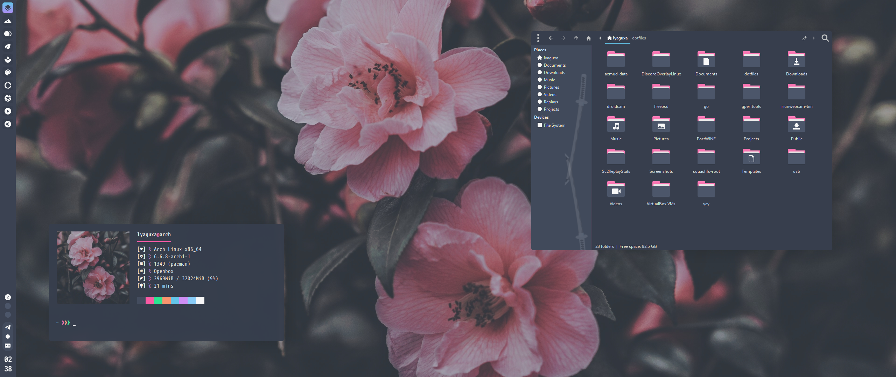

# Dotfiles ✨ ~

# Screenshots 📸



* 💫 **WM:** [Openbox](https://archlinux.org/packages/extra/x86_64/openbox/)
* 🐟 **Shell:** [Fish](https://archlinux.org/packages/extra/x86_64/fish/)
* 🏗️ **Panel/Tray:** [tint2](https://archlinux.org/packages/extra/x86_64/tint2/)
* 🔍️ **Application launcher:** [Rofi](https://archlinux.org/packages/extra/x86_64/rofi/)
* 🗃️ **File manager:** [Thunar](https://archlinux.org/packages/extra/x86_64/thunar/)
* 🔊 **Notification daemon:** [dunst](https://archlinux.org/packages/extra/x86_64/dunst/)
* ✏️ **Compositor:** [picom](https://archlinux.org/packages/extra/x86_64/picom/)
* 📝 **System info fetcher:** [neofetch](https://archlinux.org/packages/extra/any/neofetch/)
* 🧑‍💻 **Terminal emulator:** [urxvt](https://archlinux.org/packages/extra/x86_64/rxvt-unicode/)
* 🔐 **Privilege elevation:** [doas](https://archlinux.org/packages/extra/x86_64/opendoas/)
* 📦️ **AUR manager:** [yay](https://aur.archlinux.org/packages/yay)
* ⏪️ **Media player:** [mpv](https://archlinux.org/packages/extra/x86_64/mpv/)
* 🔀 **Music player:** [ncmpcpp](https://archlinux.org/packages/extra/x86_64/ncmpcpp/)


<details>
  <summary>🚧 All packages 🚧</summary>

- [wget](https://archlinux.org/packages/core/x86_64/wget/): A command-line utility for downloading files from the web.
- [xorg](https://archlinux.org/packages/extra/x86_64/xorg-server/): X.Org X server and related utilities.
- [xorg-xinit](https://archlinux.org/packages/extra/x86_64/xorg-xinit/): X.Org initialisation program.
- [xorg-server](https://archlinux.org/packages/extra/x86_64/xorg-server/): X.Org X server.
- [xorg-xrandr](https://archlinux.org/packages/extra/x86_64/xorg-xrandr/): Primitive command line interface to RandR extension.
- [xorg-xrdb](https://archlinux.org/packages/extra/x86_64/xorg-xrdb/): X server resource database utility.
- [rsync](https://archlinux.org/packages/core/x86_64/rsync/): A fast, versatile, remote (and local) file-copying tool.
- [psmisc](https://archlinux.org/packages/core/x86_64/psmisc/): Miscellaneous proc filesystem utilities.
- [dunst](https://archlinux.org/packages/community/x86_64/dunst/): A customizable and lightweight notification-daemon.
- [nitrogen](https://archlinux.org/packages/community/x86_64/nitrogen/): A wallpaper browser and setter for X.
- [openbox](https://archlinux.org/packages/community/x86_64/openbox/): A highly configurable and lightweight window manager.
- [rofi](https://archlinux.org/packages/community/x86_64/rofi/): A window switcher, run dialog, ssh-launcher and dmenu replacement.
- [rxvt-unicode](https://archlinux.org/packages/community/x86_64/rxvt-unicode/): An unicode enabled rxvt-clone terminal emulator.
- [tint2](https://archlinux.org/packages/community/x86_64/tint2/): A lightweight panel/taskbar for Linux desktops.
- [picom](https://archlinux.org/packages/community/x86_64/picom/): A lightweight compositor for X11.
- [obmenu-generator](https://aur.archlinux.org/packages/obmenu-generator/): A fast pipe/static menu generator for the Openbox Window Manager.
- [perl-gtk3](https://archlinux.org/packages/extra/x86_64/perl-gtk3/): Perl bindings for GTK3.
- [pipewire](https://archlinux.org/packages/extra/x86_64/pipewire/): Low-latency audio/video router and processor.
- [lib32-pipewire](https://archlinux.org/packages/multilib/x86_64/lib32-pipewire/): Low-latency audio/video router and processor (32-bit).
- [pipewire-pulse](https://archlinux.org/packages/extra/x86_64/pipewire-pulse/): PipeWire PulseAudio replacement.
- [pipewire-alsa](https://archlinux.org/packages/extra/x86_64/pipewire-alsa/): PipeWire ALSA replacement.
- [helvum](https://aur.archlinux.org/packages/helvum/): A dynamic tiling WM with gaps.
- [mpd](https://archlinux.org/packages/community/x86_64/mpd/): A flexible, powerful, server-side application for playing music.
- [mpc](https://archlinux.org/packages/community/x86_64/mpc/): A command line tool to interface MPD.
- [ncmpcpp](https://archlinux.org/packages/community/x86_64/ncmpcpp/): A featureful ncurses based MPD client.
- [alsa-utils](https://archlinux.org/packages/extra/x86_64/alsa-utils/): Advanced Linux Sound Architecture - Utilities.
- [brightnessctl](https://archlinux.org/packages/community/x86_64/brightnessctl/): A tool to control brightness of backlight and LEDs.
- [imagemagick](https://archlinux.org/packages/extra/x86_64/imagemagick/): An image viewing/manipulation program.
- [scrot](https://archlinux.org/packages/community/x86_64/scrot/): A simple command-line screenshot utility.
- [w3m](https://archlinux.org/packages/extra/x86_64/w3m/): A pager/text-based web browser.
- [wireless_tools](https://archlinux.org/packages/core/x86_64/wireless_tools/): Tools allowing to manipulate the Wireless Extensions.
- [xclip](https://archlinux.org/packages/extra/x86_64/xclip/): Command line interface to X selections.
- [xsettingsd](https://archlinux.org/packages/community/x86_64/xsettingsd/): Provides settings to X11 applications via the XSETTINGS specification.
- [xss-lock](https://archlinux.org/packages/community/x86_64/xss-lock/): X screen saver locker.
- [thunar](https://archlinux.org/packages/extra/x86_64/thunar/): A modern file manager for Xfce.
- [thunar-archive-plugin](https://archlinux.org/packages/extra/x86_64/thunar-archive-plugin/): Create and extract archives in Thunar.
- [thunar-volman](https://archlinux.org/packages/extra/x86_64/thunar-volman/): Automatic management of removable devices in Thunar.
- [ffmpegthumbnailer](https://archlinux.org/packages/community/x86_64/ffmpegthumbnailer/): Lightweight video thumbnailer that can be used by file managers.
- [tumbler](https://archlinux.org/packages/extra/x86_64/tumbler/): D-Bus service for applications to request thumbnails.
- [inkscape](https://archlinux.org/packages/extra/x86_64/inkscape/): Professional vector graphics editor.
- [mpv](https://archlinux.org/packages/extra/x86_64/mpv/): A free, open-source, and cross-platform media player.
- [parcellite](https://archlinux.org/packages/community/x86_64/parcellite/): Lightweight GTK+ clipboard manager.
- [pavucontrol](https://archlinux.org/packages/extra/x86_64/pavucontrol/): PulseAudio Volume Control.
- [viewnior](https://archlinux.org/packages/community/x86_64/viewnior/): A fast and simple image viewer.
- [xfce4-power-manager](https://archlinux.org/packages/extra/x86_64/xfce4-power-manager/): Power manager for Xfce desktop.
- [htop](https://archlinux.org/packages/extra/x86_64/htop/): Interactive process viewer and manager.
- [neofetch](https://archlinux.org/packages/community/any/neofetch/): A CLI system information tool written in Bash.
- [fish](https://archlinux.org/packages/community/x86_64/fish/): A smart and user-friendly command-line
  
</details>


# 🔥 Hot-keys 

| Hot-key | Action |
|---------|--------|
| **⌘ + ↵** | Terminal |
| **⌘ + E** | File manager |
| **⌘ + R** | Rofi |
| **⌘ + Esc** | System menu |
| **⌘ + Z** | Minimize window |
| **⌘ + X** | Maximize/Restore window |
| **⌘ + C** | Close window |
| **⌘ + F** | Fullscreen window |
| **⌘ + D** | Hide all windows |
| **⌘ + T** | Toggle window title |
| **⌘ + 1 - 8** | Desktop 1-8 |
| **⌘ + Shift + 1 - 8** | Send window to desktop 1-8 |
| **⌘ + left click (hold)** | Move focused window freely |
| **⌘ + right click (hold)** | Resize focused window freely |
| **⌘ + scroll up / scroll down** | Move desktop/workspace to previous or next |
| **⌘ + Space** | Openbox menu |
| **Ctr + Esc** | Last notification |
| **⌘ + PrtSc** | Screenshot menu |
| **PrtSc** | Fullscreen screenshot |
| **Shift + PrtSc** | Screenshot of selected area |
| **Ctrl + PrtSc** | Delayed screenshot |
| **Ctrl + Alt + H** | Clipboard history |

# 📌 Additionally

* 🚨 I use DOAS instead of SUDO 🚨
* 🔥 Hotkeys can be changed in `.config/openbox/rc.xml`.
* 🚀 Program settings for autostart are located in `.config/openbox/autostart.sh`.
* 🌐 Global variable settings are located in `~/.joyfuld`.
* 🌱 Wallpapers are located in `~/.wallpapers`.
* 💡 Icons are located in `~/.icons`.
* 🎨 Themes (both primary and additional) are located in `~/.themes`.

## 🍻 How to install?

🚨 **ArchLinux only!** 🚨

Be sure to clone in ~
```bash
git clone https://github.com/lyaguxafrog/dotfiles /home/$USER/dotfiles && cd /home/$USER/dotfiles && sh install.sh
```

